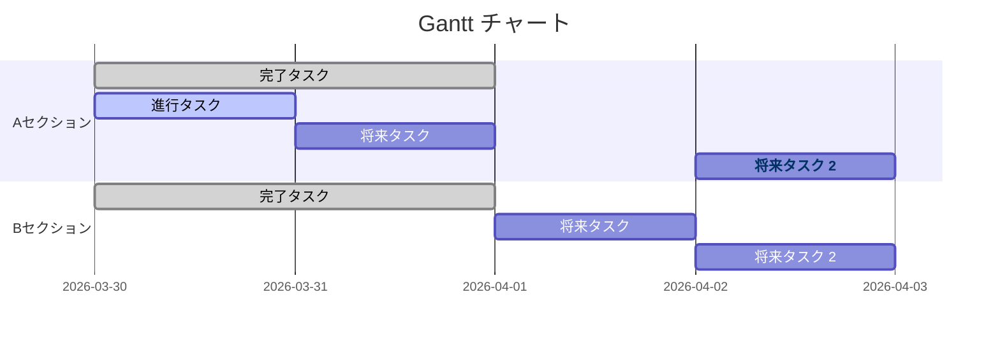

```mermaid
gantt
%%done,active,crit,milestone
tickInterval 1day
dateFormat  YYYY-MM-DD
excludes weekends,2026-01-01,2026-01-12,2026-02-11,2026-02-23,2026-03-20,2026-04-29,2026-05-03,2026-05-04,2026-05-05,2026-05-06,2026-07-20,2026-08-11,2026-09-21,2026-09-22,2026-09-23,2026-10-12,2026-11-03,2026-11-23,2026-05-01
title Gantt チャート

section Aセクション
完了タスク            :done,    des1, 2026-03-30,2026-04-01
進行タスク        　  :active,  des2, 2026-03-30, 1d
将来タスク            :         des3, after des2, 1d
将来タスク 2          :         des4, after des3, 1d
click des4 href "https://mermaidjs.github.io/"

section Bセクション
完了タスク           :done,    des1, 2026-03-30,2026-04-01
将来タスク           :         des3, after des1, 1d
将来タスク 2         :         des4, after des3, 1d
```
